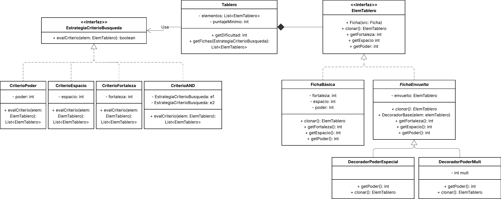

# Candy 
Se desea implementar el control de tableros de un juego de Golosinas (similar al Candy Crush). 
Cada ficha del tablero posee una fortaleza (golpes necesarios para destruirla), ocupa
un espacio del tablero (medido en cantidad de casilleros), y tiene un poder de destrucción.
Por ejemplo el “chocolate” tiene una fortaleza de 1, ocupa 1 casillero del tablero y tiene poder
de destrucción 0; la “piedra” tiene fortaleza 6, ocupa 1 casillero de tablero y tiene poder de
destrucción 0; el “caramelo a rayas” ocupa 1 casillero del tablero, tiene fortaleza 1, y un poder
de destrucción de 10; la “torta” ocupa 4 casilleros, tiene fortaleza 8 y poder de destrucción
4, y así con cada una de las distintas fichas. También existen fichas especiales cuyo poder de
destrucción se calcula como la fortaleza de la ficha, dividido el espacio que ocupan.  

Un tablero posee un puntaje mínimo que es necesario alcanzar para pasar al siguiente nivel,
una lista de fichas, la dificultad del mismo (se calcula como la sumatoria de todas las fortalezas
de las fichas, dividido la sumatoria del poder de destrucción de todas las fichas).  

En cada tablero, se debe poder buscar:
- Todas las fichas que posean un poder de destrucción mayor a 2
- Todas las fichas que ocupen más de 4 lugares
- Todas las fichas que tengan una fortaleza mayor a 5
- Combinaciones lógicas de los anteriores

## Análisis de Patrones de diseño:  
Para los distitos tipos de búsquedas, se usó el patrón Strategy. 
> Strategy is a behavioral design pattern that lets you define a family of algorithms, put each of them into a separate class, and make their objects interchangeable.
Pudiendo generar combinaciones lógicas con el implementado CriterioAND o el posible a implementar CriterioOR.  

Para las distintas fichas y sus distitas formas de calcular la fortaleza, el poder o el espacio, hay dos alternativas:  

- Usar Strategy, haciendo una estrategia para cada atributo y usar combinaciones lógicas para fichas más especiales.
- Usar Decorator, con decoradores se puede modificar de forma externa y acumulable la manera de obtener los atributos de una ficha.

Para la solución elegí usar Decorator porque permite combinar lógica de cálculo o incluso reemplazarla por completo. Así, si en el futuro existe una ficha "Poderosa" que duplica el poder, es más facil implementarla con Decorator al tener que agregarle solo una capa más que haga "return fichaEnvueltа.getPoder() * 2".
> Decorator is a structural design pattern that lets you attach new behaviors to objects by placing these objects inside special wrapper objects that contain the behaviors.

Extra: Patrón Prototype
> Prototype is a creational design pattern that lets you copy existing objects without making your code dependent on their classes.
Con este patrón se pueden clonar facilmente fichas, incluso las que están envueltas en multiples decoradores. Para esto se implementa la clonación de manera recursiva: la capa de decoración debe de saber cómo clonarse a sí misma y pedirle al objeto que envuelve que también se clone.

---
