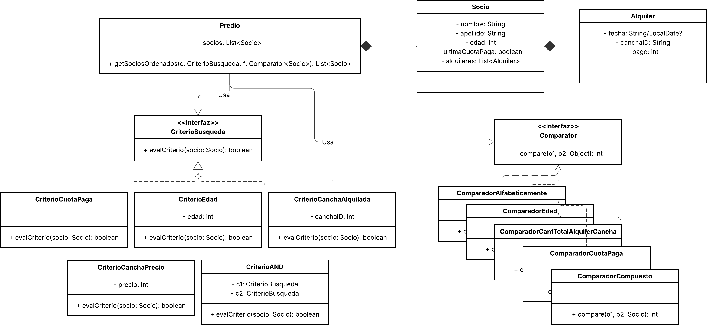

# Fútbol 
Un club de futbol 5 necesita un sistema que le permita llevar control de sus socios y
alquileres de canchas. Cada socio posee un nombre y apellido, una edad, si tiene paga la
última cuota y una lista que contiene información de los alquileres de canchas que ha
realizado. Cuando un socio alquila una cancha, se registra la fecha, el ID de la cancha que
alquiló y cuánto pagó por el alquiler.  

Cuando el dueño del club arriba al predio, le pide a los que administran el sistema, diferentes
listados, para comprobar cómo está funcionando el club:
- a) Todas los socios con cuota impaga, ordenados alfabéticamente (primero por
apellido, y si hay varios con el mismo apellido por nombre)
- b) Todos los socios menores de edad, ordenados por edad.
- c) Todos los socios que alquilaron alguna vez la cancha N°13, ordenados cantidad
total de alquileres de esa cancha.
- d) Todos los socios que pagaron más de $500 por algún alquiler de cancha, listando
primero los que tienen las cuotas pagas, ordenados alfabéticamente y luego los
morosos, también ordenados alfabéticamente.
- e) Cualquier combinación lógica de búsquedas.

## Análisis de Patrones de diseño:  
Para las búsquedas de socios se realiza un Strategy + Composite para los criterios combinados.
Para la forma de ordenar los resultados de las búsquedas, se utiliza la interfaz Comparator y se realiza un Strategy + Composite para los ordenamientos compuestos.

